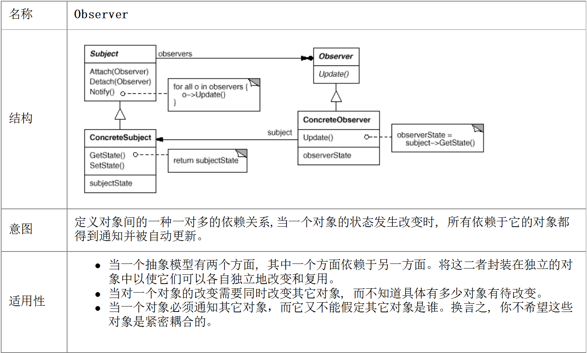

# 随便谈谈设计模式
-----

只写一些重点，以及思考，还有对于 “面向对象设计模式” 的弊端和改进。   
其实现在来看这些设计模式不过是为了填传统 OO 的坑罢了，之后会在文中详细讨论。（在写这篇文章的时候，我还没有学习函数式，所以有些理解比较肤浅）   

推荐学习资料：

- [Design Patterns Video Tutorial - Derek Banas on YouTube](https://www.youtube.com/playlist?list=PLF206E906175C7E07)
- [图说设计模式](https://design-patterns.readthedocs.io/zh_CN/latest/index.html)
- [Patterns](http://java-design-patterns.com/patterns/)
- [Huston Design Patterns](http://www.vincehuston.org/dp/)
- [面向对象编程的弊端是什么？ - 知乎](https://www.zhihu.com/question/20275578)
- [如何正确地使用设计模式？ - 知乎](https://www.zhihu.com/question/23757906)
- [Examples of GoF Design Patterns in Java's core libraries - Stack Overflow](https://stackoverflow.com/questions/1673841/examples-of-gof-design-patterns-in-javas-core-libraries)
- [GoingNative 2013 Inheritance Is The Base Class of Evil - Channel9 - 继承是万恶之源](https://www.youtube.com/watch?v=-ss9XGsENPE)
- [Functional Programming For The Rest of Us](http://www.defmacro.org/2006/06/19/fp.html)
- [A catalogue of Rust design patterns](https://github.com/rust-unofficial/patterns)
- [Design patterns implemented in Java](https://github.com/iluwatar/java-design-patterns)
- [A collection of design patterns/idioms in Python](https://github.com/faif/python-patterns)
- [设计模式原则详解 - CSDN](https://blog.csdn.net/hguisu/article/details/7571617)

&nbsp;     
&nbsp;   
&nbsp;   
设计模式概览：

- [创建型模式](#Creational)
    - [Factory Pattern](#factory)
    - [Builder Pattern](#builder)
    - [Prototype Pattern](#prototype)
    - [Singleton Pattern](#singleton)
- [结构型模式](#Structural)
    - [Adapter Pattern](#adapter)
    - [Bridge Pattern](#bridge)
    - [Composite Pattern](#composite)
    - [Decorator Pattern](#decorator)
    - [Facade Pattern](#facade)
    - [Flyweight Pattern](#flyweight)
    - [Proxy Pattern](#proxy)
- [行为型模式](#Behavioral)
    - [Chain of Responsibility Pattern](#chain_of_responsibility)
    - [Command Pattern](#command)
    - [Interpreter Pattern](#interpreter)
    - [Iterator Pattern](#iterator)
    - [Mediator Pattern](#mediator)
    - [Memento Pattern](#memento)
    - [Observer Pattern](#observer)
    - [State Pattern](#state)
    - [Strategy Pattern](#strategy)
    - [Template Method Pattern](#template_method)
    - [Visitor Pattern](#visitor)

&nbsp;    
&nbsp;    
&nbsp;    

# 创建型模式

-----

## Factory Pattern

&nbsp;     
&nbsp;    

## Builder Pattern

将用户从复杂对象的构建中剥离出来，允许用户定制扩展对象而不知晓对象的内部实现细节。   

    namespace Builder
    {
    	class CarBuilder;
    	using Car_ptr = std::shared_ptr<CarBuilder>;
    
    	enum class CarType { Tokyo, Mercedes, Volkswagen };
    
    	using type = int;
    	using name = const string&;
    	using parameter = const std::string&;
    	using Car_Parameter = std::tuple<type, name, parameter>;
    
    	Car_Parameter type2parameter(CarType carType) {
    		switch (carType)
    		{
    		case CarType::Tokyo:
    			return std::make_tuple(25, "Tokyo", "2.5L");
    		case CarType::Mercedes:
    			return std::make_tuple(7, "Mercedes", "100W RMB");
    		case CarType::Volkswagen:
    			return std::make_tuple(66, "Volkswagen", "SUV");
    		defualt:
    			return std::make_tuple(0, "", "");
    		}
    	}
    
    	class CarBuilder {
    	public:
    		static Car_ptr get_Car(CarType carType) {
    			Car_ptr cp{ std::shared_ptr<CarBuilder>(new CarBuilder(type2parameter(carType))) };
    			return cp;
    		}
    
    	private:
    		CarBuilder(Car_Parameter car_parameter) :_car_parameter(car_parameter) {}
    		CarBuilder(const CarBuilder&) = delete;
    		CarBuilder& operator=(const CarBuilder&) = delete;
    		Car_Parameter _car_parameter;
    	};
    
    	void test() {
    		Car_ptr cp = CarBuilder::get_Car(CarType::Mercedes);
    		// do something...
    	}
    }

&nbsp;    
&nbsp;    

## Prototype Pattern

&nbsp;    
&nbsp;    

## Singleton Pattern

类自身管理该类的唯一实例，并且易于被访问。   
系统**只**需要一个实例对象，并且向用户提供全局访问点。   

    namespace Singleton
    {
    	class S {
    	public:
    		using S_ptr = std::shared_ptr<S>;
    		/*
    		 * no need to lock or synchronize,
    		 * please reference to 
    		 * https://zh.cppreference.com/w/cpp/language/storage_duration#.E9.9D.99.E6.80.81.E5.B1.80.E9.83.A8.E5.8F.98.E9.87.8F
    		 */
    		static S_ptr get_S() {
    			static S_ptr s_p{ std::shared_ptr<S>(new S()) };
    			return s_p;
    		}
    
    	private:
    		S() = default;
    		S(const S&) = delete;
    		S& operator=(const S&) = delete;
    		S(S&&) = delete;
    		S& operator=(S&&) = delete;
    	};
    }

&nbsp;    
&nbsp;    
&nbsp;    

# 结构型模式

-----

## Adapter Pattern

&nbsp;    
&nbsp;    

## Bridge Pattern

&nbsp;    
&nbsp;    

## Composite Pattern

&nbsp;    
&nbsp;    

## Decorator Pattern

&nbsp;    
&nbsp;    

## Facade Pattern

&nbsp;    
&nbsp;    

## Flyweight Pattern

&nbsp;    
&nbsp;    

## Proxy Pattern

&nbsp;    
&nbsp;    
&nbsp;    

# 行为型模式

-----

## Chain of Responsibility Pattern

&nbsp;    
&nbsp;    

## Command Pattern

&nbsp;    
&nbsp;    

## Interpreter Pattern

&nbsp;    
&nbsp;    

## Iterator Pattern

&nbsp;    
&nbsp;    

## Mediator Pattern

&nbsp;    
&nbsp;    

## Memento Pattern

&nbsp;    
&nbsp;    

## Observer Pattern

&nbsp;    
&nbsp;    

## State Pattern

[a](#strategy)

&nbsp;    
&nbsp;    

## Strategy Pattern

当然了，如果允许函数作为变量来用的话，我们就可以使用 [`std::function`](https://zh.cppreference.com/w/cpp/utility/functional/function) 之类的：

    namespace Startegy
    {
    	using foo_t = std::function<int(const std::string&, double)>;
    	enum class strategy_t { I, II, III, IV };
    
    	foo_t get_foo(strategy_t strategy)
    	{
    		static map<strategy_t, foo_t> foos =
    		{
    			std::make_pair(strategy_t::I,    {return 1; }),
    			std::make_pair(strategy_t::II,   {return 2; }),
    			std::make_pair(strategy_t::III,  {return 3; }),
    			std::make_pair(strategy_t::IV,   {return 4; }),
    		};
    		auto it = foos.find(strategy);
    		return it != foos.end() ? it->second : foos[Startegy::strategy_t::I];
    	}
    
    	class A {
    	public:
    		A(foo_t foo) :_foo(foo) {}
    		A(Startegy::strategy_t strategy) :_foo(get_foo(strategy)) {}
    
    		void set_func(Startegy::strategy_t strategy) { _foo = get_foo(strategy); }
    
    		template<typename... Types> decltype(auto) foo(Types... args) { return _foo(args...); }
    
    	private:
    		foo_t _foo;
    	};
    
    	void test() {
    		A a{ strategy_t::II };
    		a.foo("hello"s, 3.14);
    	}
    
    }

&nbsp;    
&nbsp;    

## Template Method Pattern

`// ADL`

&nbsp;    
&nbsp;    

## Visitor Pattern

